```{r, include = FALSE}
knitr::opts_chunk$set(
  collapse = TRUE,
  comment = "#>",
  message = FALSE,
  echo = FALSE,
  warning = FALSE
)
```

```{r setup}
library(OCMSlooksy)
require(knitr)
require(kableExtra)
```

# Scope of OCMSlooksy
OCMSlooksy is a RShiny app dedicated for exploration of 16S rRNA gene data in microbiome research. The app does not process raw sequence data. Rather, it focuses on data analysis downstream of sequence processing pipelines, such as [Dada2](https://benjjneb.github.io/dada2/tutorial.html). In particular, OCMSlooksy is an extension of [OCMS 16S](https://ocms-16s.readthedocs.io/en/latest/), a 16S sequence processing pipeline that runs Dada2 as a [cgat-core](https://cgat-core.readthedocs.io/en/latest/) pipeline. OCMS 16S generates a SQLite database that is used as the input for OCMSlooksy. 16S data generated from other 16S sequence processing pipelines can still be analysed with OCMSlooksy, using the [`OCMSlooksy::create_db`](#FromCountTable) function. 

# Installing OCMSlooksy
OCMSlooksy is an R package that contains the app and several helper functions that help prepare input files required for the app. The OCMSlooksy R package can be installed from the [OCMS github](https://github.com/OxfordCMS).

```{r looksy-install, echo=TRUE, eval = FALSE}
# download and install package
devtools::install_github("https://github.com/OxfordCMS/OCMSlooksy", 
                         build_vignettes = TRUE)
# load OCMSlooksy package
library(OCMSlooksy)
```

# Preparing Input Data {#PrepareInput}
The app requires two input files: a SQLite database file and a metadata file. Both of these files have specific formatting requirements, which are detailed in this section.

## From OCMS 16S
The OCMS 16S output database would have been specified in the pipeline config file (`pipeline.yml`). The database is a SQLite database file and can be directly used as the input into OCMSlooksy.

## From count and taxonomy tables {#FromCountTable}

The OCMSlooksy package includes several functions that facilitate preparing input data for the app. The `create_db()` function creates a SQLite database file from tab-delimited or comma-delimited files and configures the database such that it can be used as the input file for the OCMSlooksy app.

`create_db` has 5 arguments:

* `counts` -- file or dataframe of feature (ASV or OTU) counts for each sample
* `taxonomy` -- file or dataframe of feature taxonomy classifications
* `outdir` -- directory where database will be saved
* `db_name` -- name of database. Default `db_name = "OCMSlooksy.db"`
* `fromfile` -- Are count and taxonomy tables supplied as files (`fromfile=TRUE`) or as R dataframes (`fromfile=FALSE`)

Example code to make database file from count and taxonomy table files:

```{r example-createdb1, echo=TRUE, eval=FALSE}
# not run
create_db(counts = 'my_count_table.tsv',
          taxonomy = 'my_taxonomy_table.tsv',
          outdir = '/path/to/output/directory',
          db_name = 'mydatabase.db',
          fromfile = TRUE)
```

`create_db` requires two tables: a count table which contains features (ASVs or OTUs) for each sample, and a taxonomy table which contains the taxonomy classification associated with features found in the count table. 16S rRNA gene sequence processing pipelines vary in the format of their outputs, but most provide a tab-delimitted or comma-delimited spreadsheet containing this information. You will need to re-format (or create a new file) such that the count and taxonomy tables conform to the following requirements:

 count table requirements:
 
 * samples in columns and features (ASVs or OTUs) in rows
 * first column should contain feature identities under the heading `featureID` (column name is case sensitive)
 * feature IDs must be unique
 
 Example count table:
 
```{r example-count}
set.seed(1)
my_count_table <- data.frame(featureID = paste0('ASV', 1:8), 
                  SampleA = sample(0:20000, 8, replace=TRUE, 
                                   prob=c(0.5, rep(0.5/999, 20000))),
                  SampleB = sample(0:22000, 8, replace=TRUE, 
                                   prob=c(0.2, rep(0.8/999, 22000))),
                  SampleC = sample(0:21500, 8, replace=TRUE, 
                                   prob=c(0.5, rep(0.5/999, 21500))),
                  SampleD = sample(0:21000, 8, replace=TRUE, 
                                   prob=c(0.15, rep(0.8/500, 11000), rep(0.05/500, 10000))))

kable(my_count_table) %>% kable_styling()
```
 
 taxonomy table requirements:
 
 * contains taxonomy classifications that correspond to features in count table
 * first column contains feature IDs under the heading `featureID`
 * Must contain the columns `featureID`, `sequence`,
   `Kingdom`, `Phylum`, `Class`, `Order`, `Family`,
   `Genus`, `Species`, `Taxon`. Column names are case-sensitive.
 * if `sequence` for a feature is not known, you can leave the column empty
 * if `species` for a feature is not known or is not classified, set species to `NA`. The same rule applies other taxonomy levels.
 * `Taxon` contains classifications at all taxonomic levels, separated by a semicolon. Taxonomy names can be pre-pended with the initial of the taxonomy level but it is not necessary.
 (e.g. k__Bacteria;p__Firmicutes;c__Clostridia;o__Clostridiales;f__Ruminococcaceae;g__Faecalibacterium;s__NA")

Example taxonomy table:

```{r example-tax}
my_taxonomy_table <- data.frame(featureID = paste0('ASV', 1:8),
                  sequence = '',
                  Kingdom = 'Bacteria',
                  Phylum = c(rep('Firmicutes', 3), rep('Bacteroidetes',3),
                             rep('Proteobacteria',2)),
                  Class = c(rep('Clostridia',2), 'Bacilli', rep('Bacteroidia',3),
                            rep('Gammaproteobacteria',2)),
                  Order = c(rep('Clostridiales',2), 'Lactobacillales',
                            rep('Bacteroidales',3),
                            rep('Enterobacterales',2)),
                  Family = c('Ruminococcaeae','Clostridiaceae',
                             'Lactobacillaceae',
                             rep('Bacteroidaceae',2),'Prevotellaceae',
                             rep('Enterobacteraceae',2)),
                  Genus = c('Faecalibacterium','Clostridium','Lactobacillus',
                            rep('Bacteroides',2),'Prevotella',
                            'Escherichia','Citrobacter'),
                  Species = NA)

my_taxonomy_table$Taxon <- paste(
  my_taxonomy_table$Kingdom, my_taxonomy_table$Phylum, my_taxonomy_table$Class,
  my_taxonomy_table$Order, my_taxonomy_table$Family, 
  my_taxonomy_table$Genus,my_taxonomy_table$Species, sep=";")
kable(my_taxonomy_table) %>% kable_styling()
```

The count and taxonomy tables can be supplied as .tsv or .csv files by setting `fromfile = TRUE` (default). Alternatively, if count and taxonomy tables are already in R, set `fromfile = FALSE` and supply dataframes to the `counts` and `taxonomy` arguments, respectively.


Example code to make database file from count and taxonomy tables already in R as `dataframe`'s

```{r example-createdb2, echo=TRUE, eval=TRUE}
# example of count table as R dataframe
print(my_count_table)
# example of taxonomy table as R dataframe
print(my_taxonomy_table)
```

```{r example-createdb3, echo=TRUE, eval=FALSE}
# not run
create_db(counts = my_count_table,
          taxonomy = my_taxonomy_table,
          outdir = '/path/to/output/directory',
          db_name = 'mydatabase.db',
          fromfile = FALSE)
```


## Preparing metadata file
The second input file required by OCMSlooksy is a metadata file that contains sample specific details (i.e. group, treatment, replicate number, etc.). The formatting requirements for the metadata file is as follows:

* samples in rows and metadata variables in columns
* samples are identifiers are unique and match those in the database
* samples are listed in a column called `sampleID` (column name is case sensitive)
* column names do not contain special characters and do not start with a number. Spaces and dashes (`-`) are automatically replaced with underscores (`_`) within the app.

Example metadata file:

```{r example-met}
out <- data.frame(sampleID = paste0('Sample', LETTERS[1:8]),
                  treatment = rep(c('control','control',
                                    'probiotic','prebiotic'),2),
                  centre = rep(c('site1','site2'), each=4))

kable(out) %>% kable_styling()
```

Metadata files can be manually created in a spreadsheet and saved as a .csv or .tsv file. Alternatively, the `metfile_init` function initiates a metadata file from the database file or a tab-delimited count table file. This function reads your database file and creates a bare-bones metadata file that you can add to.

`metfile_init` contains 5 arguments:

* `db_file` -- SQLite database file used as OCMSlooksy app input. Set to `FALSE` to use a count table in a tab-delimited file
* `out_dir` -- output directory where initiated metadata file will be saved. Default `NULL` means output not written to file but returns a dataframe.
* `ref_table` -- name of table in database from which sampleID are generated. default `NULL`. When `NULL`, assumes table is `merged_abundance_id` which is the count table produced from the ocms_16s dada2 pipeline or produced from `create_db`. When initiating the metadata file from a count table, set `db_file`
   to `FALSE` and count table is supplied in `ref_table` as a tab-delimited file. The count table file supplied has the same [requirements](#FromCountTable) as `counts` count table in `create_db` 
* `id_orient` -- indicates orientation of sample IDs. default 'col' indicates
   samples are in columns. 'row' indicates samples are in rows and
   sample IDs are in the first column
* `dummy` -- default NULL. when string supplied, adds a dummy column of NAs with the string as the column name.

Example code to initiate metadata file from database:

```{r example-metfile1, echo=TRUE, eval=FALSE}
# not run
metfile_init(db_file = 'mydatabase.db',
             out_dir = '/path/to/output/directory',
             ref_table = NULL,
             id_orient = 'col',
             dummy = 'treatment')
```

Example code to initiate metadata file from count table file:
```{r example-metfile2, echo=TRUE, eval=FALSE}
# not run
metfile_init(db_file = FALSE,
             out_dir = '/path/to/output/directory',
             ref_table = 'my_count_table.tsv',
             id_orient = 'col',
             dummy = 'treatment')
```

Setting the `dummy=treatment` means the metadata file initiated will have a column of `sampleID` and an empty column of `treatment`. This is, of course, optional and is there to demonstrate how the metadata file can be populated with associated variables.

# Launching the OCMSlooksy app
The app is launched from within R. To start the app, write the following command in the R console:

```{r launch-app, echo=TRUE, eval=FALSE}
OCMSlooksy::run_app()
```

The app will launch in your browser (you don't need internet access to run the app) so you may have change your browser settings to allow pop-up windows if pop-ups are disabled.

{width=100%}

# Navigating the OCMSlooksy app

## Data Preparation and Analysis Modules
Different types of data analysis are organized into "analysis modules" to reflect the type of analysis being conducted. Once your data set is uploaded, you can work your way through the tabs laid out horizontally across the top. If your data set was processed with OCMS 16S, the sequence processing steps applied in the pipeline is summarized in the [QC Report](#QCReport) tab. 

Next, you must select the samples you would like to analyze in the [Filter Samples](#FilterSample) tab before proceeding with the analysis modules. Analysis modules are listed in a dropdown menu from the [Analysis Module](#AnalysisModule) tab. Modules typically include several data preparation steps that are necessary to prepare your data for the analyses conducted in a given module. A data module may contain one or several different analyses. Data preparation steps are listed in the side bar on the left hand side of the screen, and you progress through the steps in a top-down order. Once data preparation has been completed, the analyses within a module can be completed in any order.

## Downloading tables and figures
All tables shown in the app are downloadable via the "copy" and "csv" buttons in the top left corner of the table. The "copy" button copies the entire table to your clipboard, while the "csv" button allows you to save to your computer. There is also a search bar in the top right corner of each table. This allows you to search the entire contents of the table. Some tables have search bars under each column, which allows you to search the table by columns.

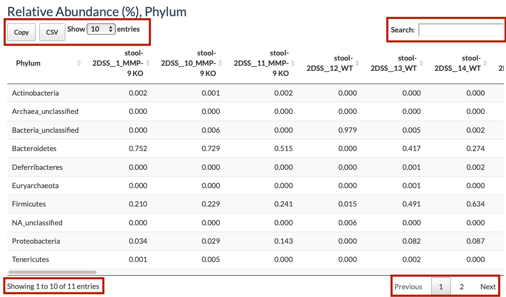{width=100%}

All plots have a save icon (`r shiny::icon('save')`) that contains a drop-down menu of the different ways the plot can be downloaded.

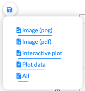

* "Original plot" downloads the static figure as a .png file. Note this defaults to 5in x 7in so large figures may looked squished
* "Interactive plot" downloads the interactive figure as a .html file.
* "Plot data" downloads the data used to generate the plot as a .csv file. This may be useful if you wish to recreate the plot yourself in R or using other software.
* "RDS" downloads the plot as an R object in the form of an .RDS file. In most cases, this is a `ggplot` object, while heatmaps are saved as an object of class `heatmapr` from the R package `heatmaply`. This is is useful if you wish to modify the plot in R.
* "All" downloads "Original plot," "Interactive Plot," "Plot data," and "RDS" in a .zip file.

Note: Given constraints with the `heatmaply` package used to generate interactive heatmaps, you cannot download heatmaps shown in the app as static figures. You can, however, take advantage of the `plotly` functions that appear in the top right corner when you hover over a figure. More details on this in the ["Interactive Plots"](#interactiveplots) section.

## Interactive Plots {#interactiveplots}
All figures in the app are interactive. Some tips on interacting with figures are:

* hover over data points to see the data values
* zoom in to a figure section by clicking and dragging over that portion of the figure
* double click a legend item to only show that item on the plot/hide all other items on the plot; single click hidden items to add the to the plot
* single click a legend item to hide one item at a time; single click a hidden legend item to unhide that item

Plots are made interactive using `plotly`. As such, there are plot interaction tools that appear in the top right corner of a plot when you over over it. You can toggle the different tools on/off to take advantage of their functionality. 


Descriptions of each tool in the tool bar in Figure 2C can be found [on the plotly website](https://plotly.com/chart-studio-help/getting-to-know-the-plotly-modebar/). Briefly, in order from left to right:

* downloads figure as displayed
* select to zoom
* pan across figure
* rectangle select region
* free-form select region
* zoom in
* zoom out
* autoscale axes to zoom plot to include all viewable data
* reset axes
* toggle spike lines -- draws horizontal and vertical lines from cursor to axes
* display data values when hovering over data point
* displays data for all points with the same x-value
* plotly logo links to plotly website

## Downloading reports
Each analysis module produces a report in the form of a downloadable pdf or html file. The report will include parameters applied in the analysis and tables and figures generated in the task.

# Import Data

Details on data files to upload and their required formatting are provided in the [Preparing Input Data](#PrepareInput) section.

Click 'Browse' to select the database file and metadata file from your computer. Once data has been uploaded, click the 'Launch Dataset' button. Alternatively, you can use the example dataset that accompanies the app.

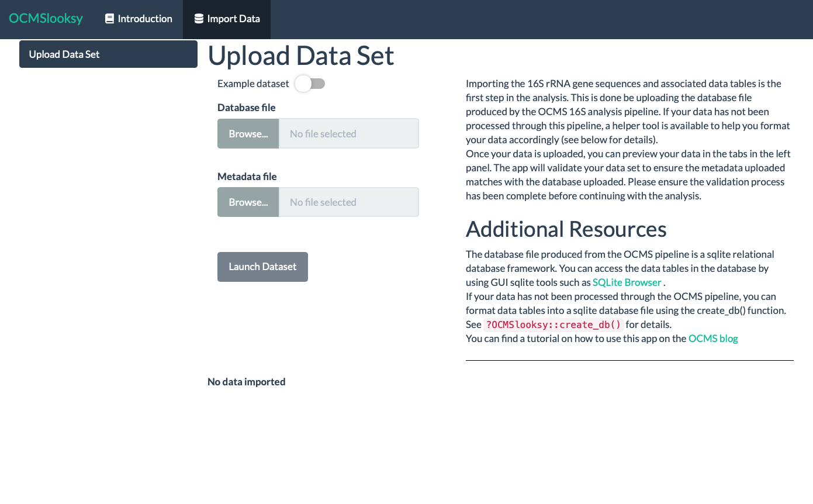{width=100%}

Once the uploaded data is validated, previews of the metadata, count data, and taxonomy data will become available in the side bar.

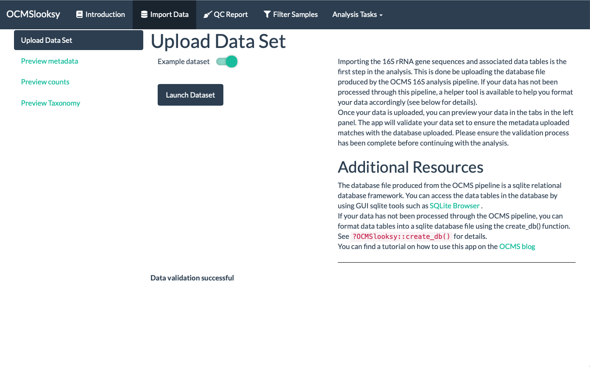{width=100%}

# QC Report {#QCReport}

If ocms_16s pipeline was used to process your reads, a quality control report will be available. This report outlines all the processing steps that were applied to the raw sequence data and summarizes the pipeline parameters applied throughout.

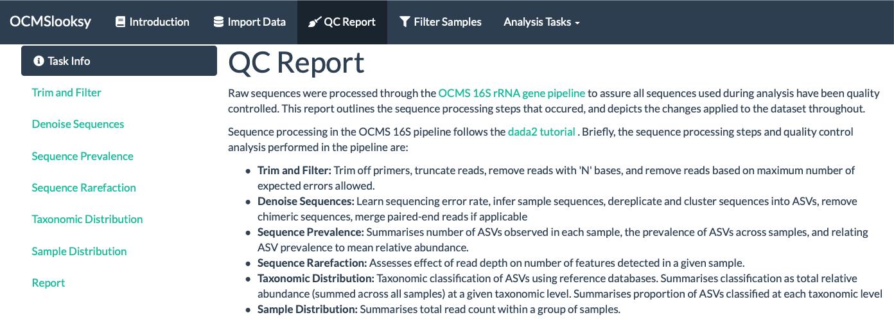{width=100%}

# Filter Samples {#FilterSample}

This step allows you to specify which samples will be used in all subsequent analysis modules. Broadly, you may want to drop samples for one of two reasons. One reason is that the QC report revealed that some of the samples did not sequence successfully (you got reads, but they were filtered out during sequence processing or most of the sequences in that sample failed to be classified). Another reason to filter samples is because the research question to be pursued in downstream analysis is only applicable to a subset of samples.

Filtering samples is not mandatory, and you can choose to continue analysis with all samples by choosing "Use all samples" and clicking the "Filter samples" button. Otherwise, you can filter samples by choosing "Include select samples" or "Exclude select samples," which ever is more convenient. This brings up a table from which individual samples can be selected, or you can select a block of samples by clicking the first sample then holding down `shift` while clicking the last sample. You can also use the column filters or the search bar in the top right corner to customize which samples are shown in the table. When the desired samples have selected, click the "Filter sample" button.

You can always use the `r shiny::icon('undo-alt')` button to reset your selection and clear any previous filtering applied.

# Analysis Modules {#AnalysisModule}
Individual analyses are organized in the "Analysis Modules" drop down menu. 

* [Microbiome Profile](#MicrobiomeProfile)
* [Alpha-Diversity](#AlphaDiversity)
* [Beta-Diversity](#BetaDiversity)
* [Differential-Abundance](#DiffAbund)
* [Pairwise Feature Comparison](#FeatureCompare)

These analysis modules are all performed independently from one another, and they can be completed in any order. For the majority of the modules, the data will need to be processed before continuing with the analysis. 

## Common Data Processing Steps
### Aggregate Features {#aggregate_feature}
This step allows you to aggregate counts at a given taxonomic level. Choosing to aggregate counts by `featureID` is equivalent to not applying any aggregation.

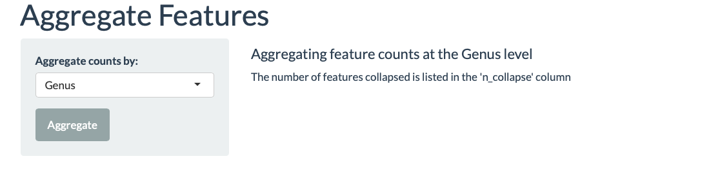{width=100%}
Once read counts have been aggregated, the taxonomy table is updated such that taxa beyond the level of aggregation are set to `NA`. Furthermore, the `n_collapse` column summarizes the number of features that were aggregated together. A preview of the aggregated taxonomy table and count table becomes available once aggregation is complete.

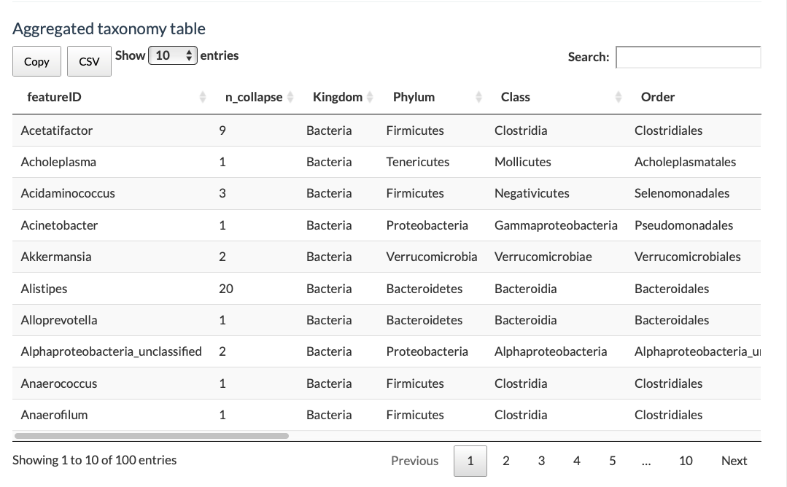{width=100%}

### Filter Features {#filter_feature}
Sequences processing would have removed sequences based on quality and minimum count threshold. This step filters features (ASVs or OTUs) using one of two methods. The first method is based on feature abundance and prevalence (the number of samples in which the feature reaches the abundance threshold). The second method is based on selection, where you can choose which features to omit from the analysis. The second method should only be applied in a special use-case, which is described below.

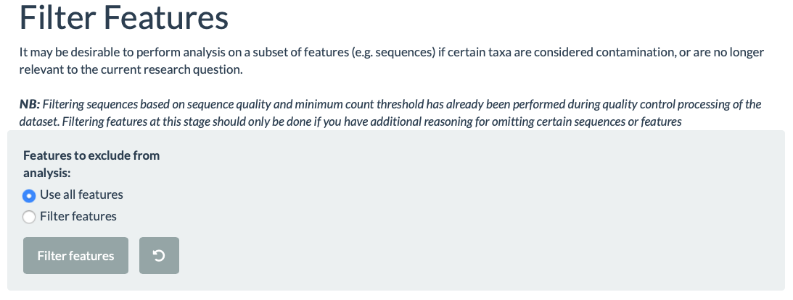{width=100%}

#### Filter by abundance and prevalence
Filtering features based on abundance and prevalence is an effect means of reducing the amount of noise in your data set. For example, features that are observed at a very low abundance and only in a few samples are likely to be spurious, thus can be omitted. On the other hand, features that have low abundances but are found in most samples are likely to be real signals.

There are three ways you can set the abundance thresholds:

1. Based on the number of reads in a sample (e.g. keep features at least 3 reads)
2. Based on the relative abundance in a sample (e.g. keep features that make up at least 0.1% of a sample)
3. Based on the relative abundance contribution to the whole data set (e.g. keep features that make up at least 0.001% of the entire data set.)

The prevalence threshold indicates the minimum number of samples in which the feature meets the abundance threshold. The default is set to 5% of the number of samples in your data set.

The default values are good starting places, but filter thresholds should always be set on a case-by-base basis. A histogram of each metric (prevalence, read count, percent sample, percent of data set) is available on the right side to help inform your decision.

Once the threshold parameters have been set, click the "Filter features" button to apply the changes. You can use the `r shiny::icon('undo-alt')` button to clear previous filtering attempts.

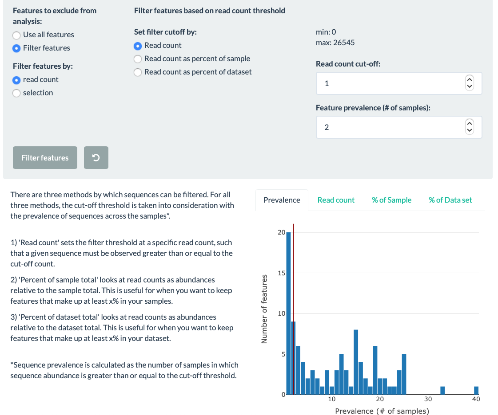{width=100%}

It's recommended that you take an iterative approach to finding the filter parameters that best suit your data. To help you evaluate the effectiveness of the filter, we generate a scatter plot summarizing the features according read count abundance and prevalence, highlighting features that were filtered out. The scatter plot is shown in "Aggregated view" and "Expanded view" where the former shows one point per feature and the y-axis refers to the mean read count. The latter, expanded view, shows the feature read counts for every sample. Given the large number of data points, the expanded view may take a few minutes to render if you have a large data set (>100 samples)

Finally, the filtered results are described in the right panel. Notice that the app applies a secondary check for empty samples or features after the filtering has been completed. Empty samples and features are automatically removed from the data set. Finally, a preview of the filtered data is shown in a table.

{width=100%}
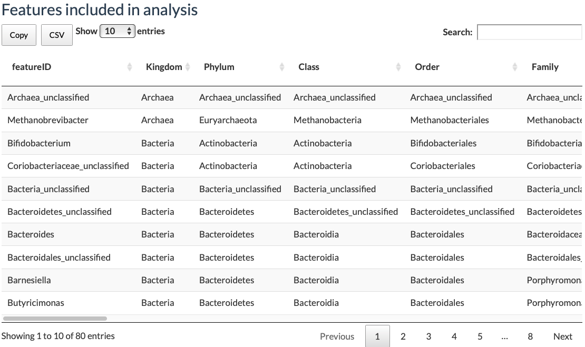{width=100%}

#### Filter by selection
Just like filtering samples by selection, you can select which features you want to omit. There are two specific use-cases for when you would want to selectively filter features. The first, is to drop features that have been identified as contaminants in preliminary analysis. The app currently does not include a feature to detect and address contaminants (such as using [Decontam](https://www.bioconductor.org/packages/release/bioc/html/decontam.html)), so any analysis for kit contamination would have to be done outside of OCMSlooksy.

The second reason is if you want to perform specific analysis on a particular subset of features. For example, it may be desirable to omit features that are unclassified at the Kingdom of Phylum level. These features are not biologically informative. As such, you may want to filter out any features that are unclassified at high taxonomic levels.

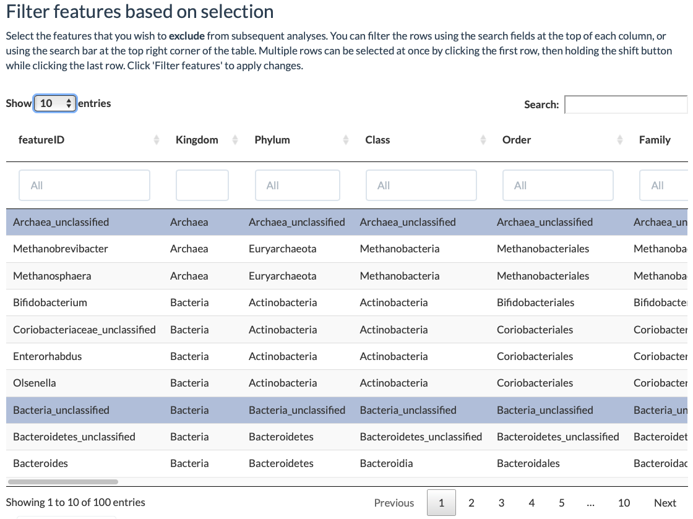{width=100%}

Another example of performing analysis on a subset of features is to perform downstream analysis on a specific taxonomic group. Such as creating a microbiome profile of only features in the phylum Actinobacteria. You can select all features that are not part of the phylum Actinobacteria, using the column filters to control which rows are shown in the table. Then opt to show the microbiome profile at the genus level. More details on the Microbiome Profile module below. 

## Microbiome Profile {#MicrobiomeProfile}
Visualizing the microbiome profiles of samples or groups of samples is done in the Microbiome Profile analysis task. [Aggregate Features](#aggregate_feature) and [Filter Features](#filter_feature) are required data processing steps before you can move on to create microbiome profiles or visualize profile sparsity.

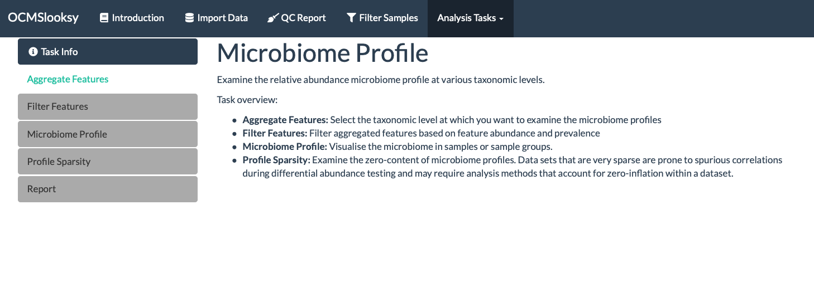{width=100%}

Next, set the plot parameters and click "Apply changes" to show/update the plot. To view the microbiome profiles on a per-sample basis, set the `x-axis` to "sampleID." Setting the x-axis on a group of samples will show the mean abundance. The `panel_by` parameter allows you to visualize samples/sample groups in separate panels. You have the option to show profiles as relative abundance profiles or as read count abundances using the `y-axis` parameter. Lastly, you can select the taxonomic level used for visualization with `taxonomic level`. Note the taxonomy levels available for visualization is limited by the level used to aggregate features in the data processing step (i.e. you cannot visualize at the ASV level if you aggregated at the genus level).

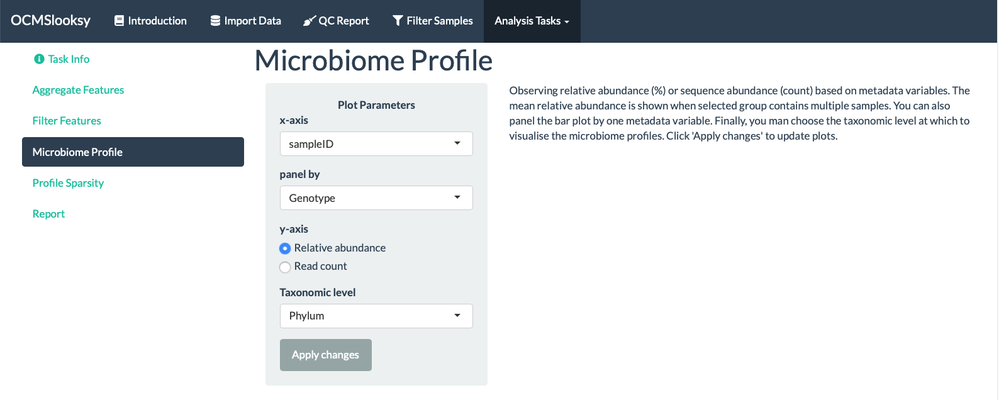{width=100%}

Applying changes will update an abundance table and show interactive plot of the microbiome profiles.

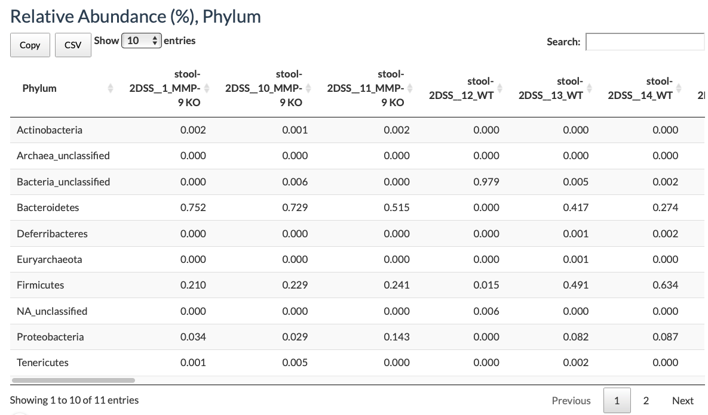{width=100%}
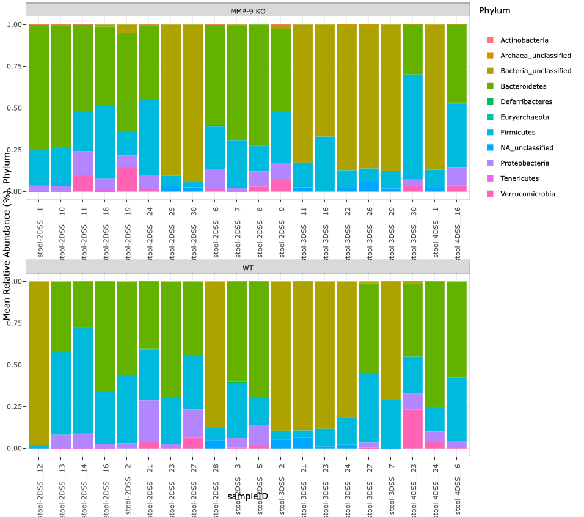{width=100%}

## Profile Sparsity
Sparse microbiome profiles are commonly observed, particularly in the gut where diversity is high and microbiome members can be rare. In addition to being a descriptive characteristic of the microbiome profiles, sparsity also affects the performance of modelling methods used to identify differentially abundant taxa. The OCMSlooksy app is not currently equipped to apply different modelling methods to address model performance, such as inflated false positives due to high sparsity. Even so, Profile Sparsity provides two figures that illustrate how sparse your microbiome profiles are.

The first is a histogram of the proportion of zeroes observed in a given sample. In Figure 11A, we see that most samples contain 45-75% zeroes, wiith only 1-3 samples in each bin. There are a group of samples that have a very high proportion (>90%) of zeroes; 1 sample with 92%, 5 samples with 93%, and 9 samples with 95% zeroes.

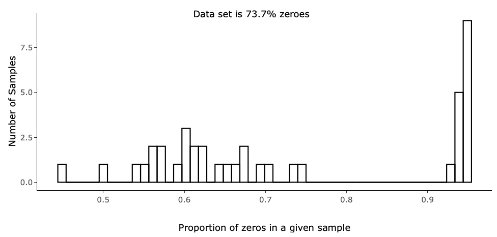{width=100%}

The second is a presence/absence heatmap showing the presence or absence of a taxon in each sample. Taxonomy level is dictated by the taxonomy level used to aggregate features during the data preparation stage of the analysis task. Absent taxa are coded as 0 (purple) while prsent taxa are coded as 1 (yellow). This highlights the most prevalent taxa in the data set while revealing those that tend to be rare.

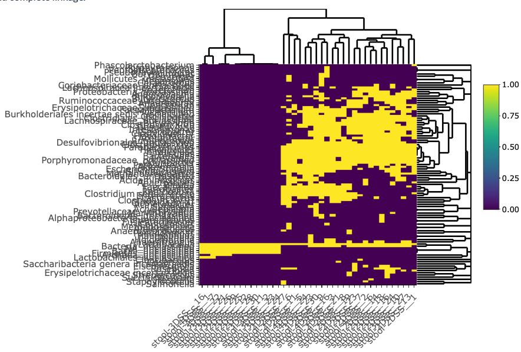{width=100%}

## Alpha-Diversity {#AlphaDiversity}
Alpha-diversity assesses diversity on a per-sample basis. As such, you can compare samples, or group of samples, based on their alpha-diversity. Four different alpha-diversity metrics are calculated, plus the richness and evenness of each sample. The alpha-diversity metrics were calculated as described in [Jost 2006](https://doi.org/10.1111/j.2006.0030-1299.14714.x) where the different indices are described alongside their nuances and applications. In short, Shannon and Simpson are entropy measures that refer to uncertainty associated with predicting the observed proportional abundances. In other words, how well can you predict the identity of species selected at random. Shannon's D and Inverse Simpson are measures of diversity that reflect the number of species observed weighted by their proportional abundances. Both are derived from their respective entropy measures. The diversity metrics used in this analysis module are calculated as follows:

*Shannon Index: `vegan::diversity(index="shannon")`
*Shannon's D Index: `exp(Shannon Index)`
*Simpson Index: `vegan::diversity(index="simpson")`
*Inverse Simpson Index: `vegan::diversity(index="invsimpson")`
*Richness: `vegan::specnumber()`
*Evenness: `Shannon Index/ log(Richness)`

All six alpha-diversity measures are calculated and displayed in a table

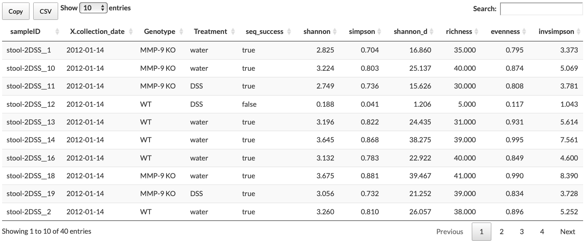{width=100%}

The alpha-diversity measures are also displayed in graphical form. By default, only evenness, richness and Shannon's D are shown, though others can be selected. The measures can be displayed on a per-sample basis (default) or you can compare groups of samples.

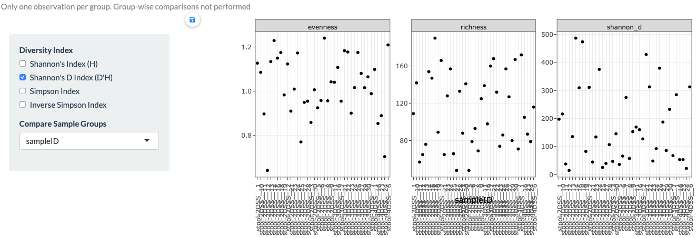{width=100%}

When the groups being compared has enough samples (more than two samples), either a Wilcoxon t-test (comparing two groups) or a Kruskal-Wallis test (comparing more than 2 groups) will be performed, with Benjimani-Hochberg correction for multiple testing applied.

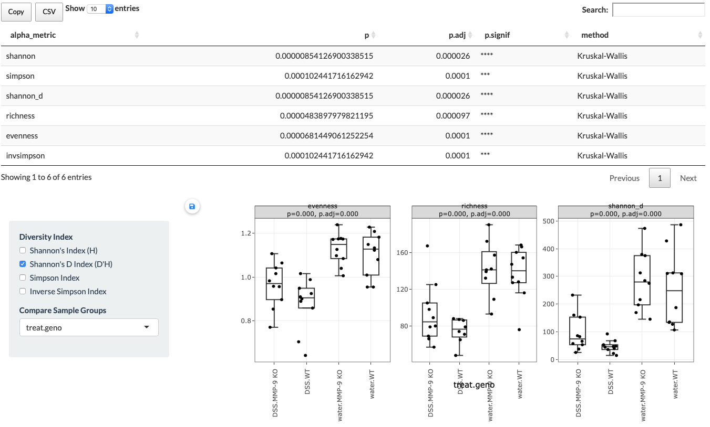{width=100%}

## Beta-Diversity {#BetaDiversity}
Beta-diversity describes the microbial ecosystem across samples (as opposed to alpha-diversity which is calculated within one sample at a time). There are several analysis methods and data visualization tools that characterize the beta-diversity of a given set of samples. Within this analysis task, there are four analyses available: Sample Dissimilarity, Principal Coordinate Analysis (PCoA), Principal Component Analysis (PCA), and Permutational Multivariate Analysis of Variance (PERMANOVA). The selection of analyses available to you depends on how the read counts are transformed during the data preparation step.

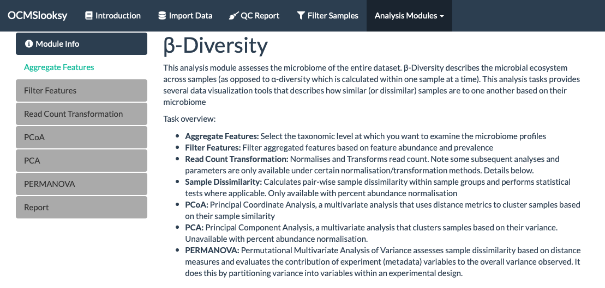{width=100%}

### Read Count Transformation
In addition to Aggregate Features and Filter Features, one of the data preparation steps in beta-diversity analysis is normalizing and transforming the read counts. In general normalization refers adjusting for differences in read depth across samples and transformation addresses the compositional nature of sequence counts. Three different methods of normalization/transformation are available:

* centre log-ratio (CLR)
* log10 of percent abundance
* percent abundance

**Centre log-ratio** is considered both a normalization and transformation step. CLR transformation is performed using [`ALDeX2::aldex.clr()`](https://www.bioconductor.org/packages/devel/bioc/manuals/ALDEx2/man/ALDEx2.pdf) on read counts. It should be noted that his step uses a probability-based method to impute zeroes before performing CLR transformation. As such, if your dataset is sparse (has a lot of zeroes) this type of transformation may not be appropriate.

**log10 of percent abundance.** Read counts are normalized by convert to relative abundance of a sample (ranges 0-1), then subjected to `log10` transformation. 

**percent abundance** Read counts are normalized to relative abundance (ranges 0-1). No transformation is performed. As such, PCA is not permissible under this method. At the same time, Sample Dissimilarity, which measure Bray-Curtis distances between two samples in a pair-wise manner, is only available with this option.

Once a transformation method has been applied, a table of the normalized/transformed values will be available.

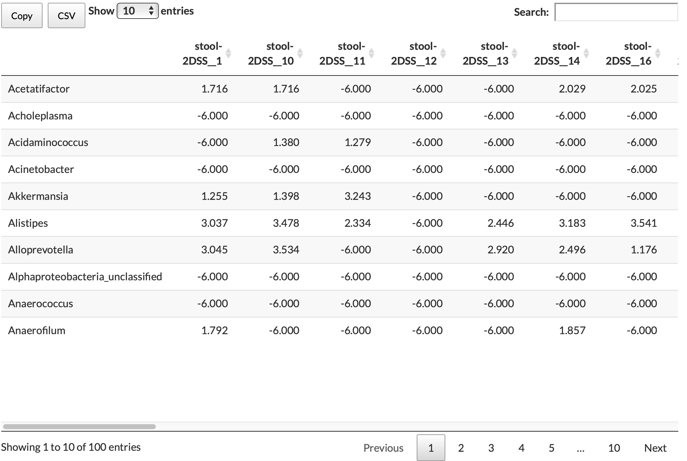{width=100%}

### Sample Dissimilarity
This analysis measures pairwise sample dissimilarity by Bray-Curtis distance. This analysis is only available with percent abundance transformation. 

{width=100%}
Sample dissimilarities can also be calculated within sample groups by selecting a metadata variable in the "Compare Sample Groups" parameter. If the selected variable only has one group, then sample dissimilarity is measured for every sample against all other samples. At the same time, you can assess dissimilarity on subsets of the sample by setting the "panel by" parameter. 

In the example below, we've compare treatment groups for each host genotype. You can see that the within-group sample dissimilarity of DSS-treated mice is not statistically different than that of the control treatment, and the same trend is observed in both genotypes.

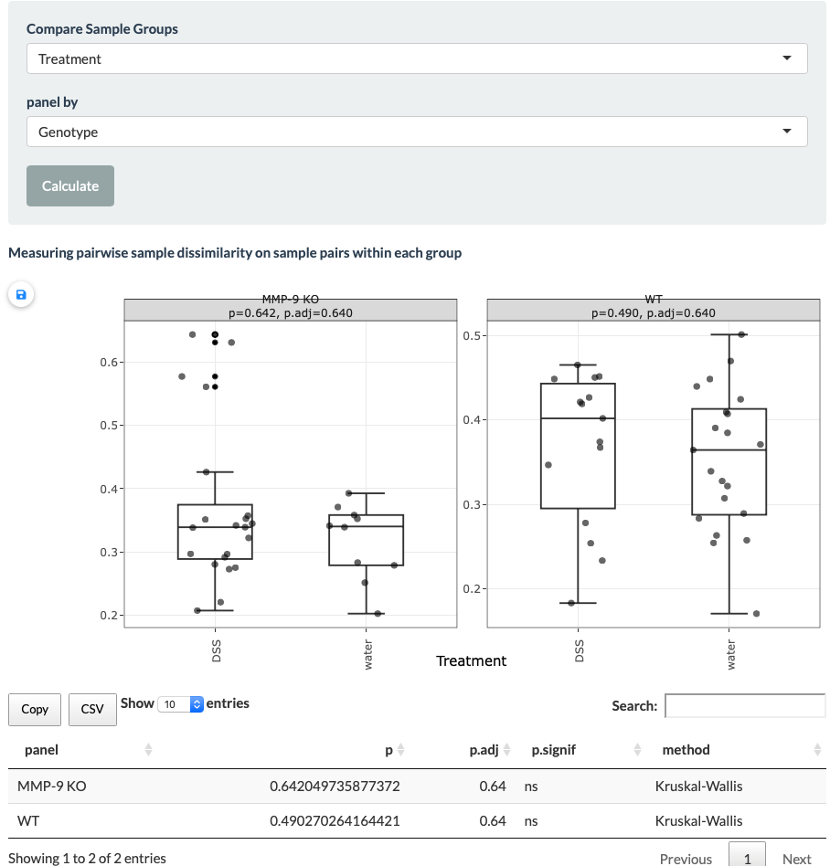{width=100%}

As usual, the calculated Bray-Curtis dissimilarity values are displayed in a downloadable table.

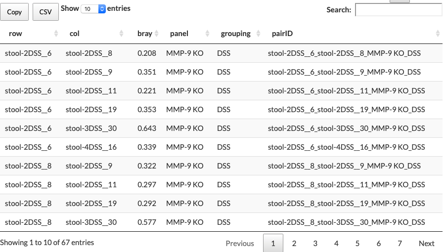{width=100%}

### PCoA
PCoA is a supervised multivariate analysis that depicts sample similarity by calcualting sample distances. Various methods of calculating sample distances are available (manhattan, euclidian, and canberra), though if samples have been normalized to percent abundance in the "Read Count Transformation" step during data preparation, only Bray-Curtis distance distance is available.

To start the PCoA, select the desired distance metric and click "Calculate"

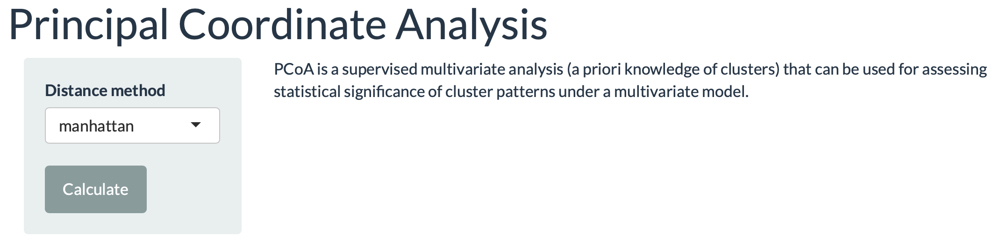{width=100%}

Sample distance matrix is provided as a table.
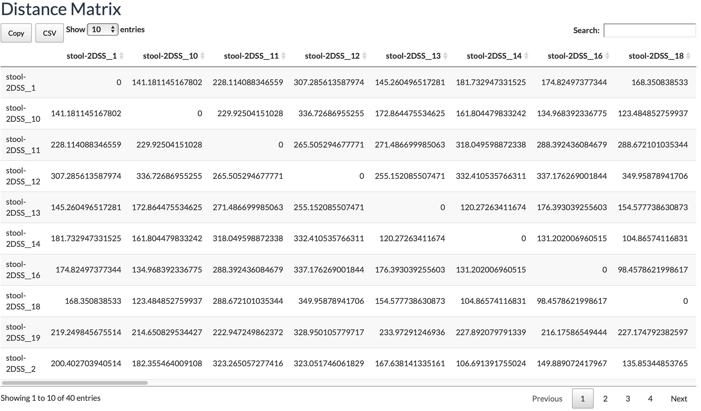{width=100%}

The percent variance explained by each principal coordinate (PC) axis is provided in the PCoA Summary. PC1 explains the most variance, with each subsequent PC accounting for smaller additional percent variance. The cumulative explained variance of the PCs are also shown in the summary. In general, during data exploration, it is a good idea to view the PCs up to 80% cumulative explained variance. Though usually just the first two PCs are presented.

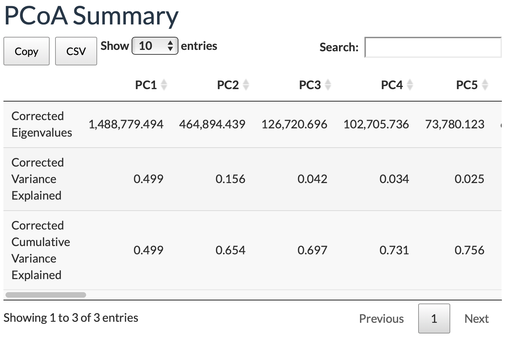{width=100%}

The PCoA plot is customizable in terms of setting the colour and labelling scheme of the data points. By default, the PCoA displays the first two PCs as they capture the most sample variance, but this is customizable with the PC axis drop-down menu. 

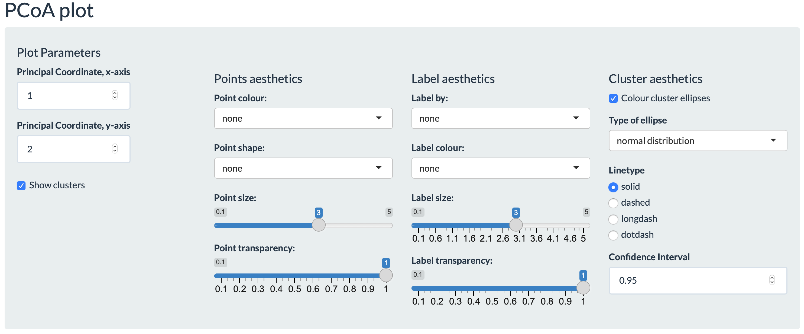{width=100%}

Colour, shape, size, and transparency of data points and point labels are extra plot aesthetics you can use to customize the PCoA plot.

To show 95% confidence intervals around sample groups, set the variable of interest as the point colour and have the "Show clusters" tick box checked. The confidence interval and underlying distribution assumption of the confidence interval affect the how the confidence interval is determined. Additionally, the linetype used to draw the ellipse can be customized (solid line, dashed line etc.)

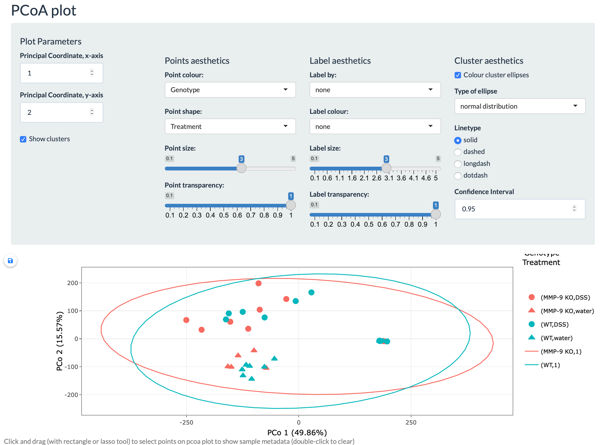{width=100%}

Sometimes, it may be convenient to find out more about a specific sample in the PCoA besides the colour and label annotations. You can select samples on the PCoA plot using the rectangle or lasso selection tool (icons appear when you hover over the top right corner of the interactive plot). The metadata of the selected samples will be shown below the PCoA plot.

In our example below, neither genotype nor treatment group explains the cluster of samples on the right. We highlight those samples, and the metadata table shows that those samples all have "seq_success" of "False". This tells us that those samples are likely outliers in the dataset for technical reasons and can be excluded from the analysis (using the [Filter Samples](#FilterSample) step).

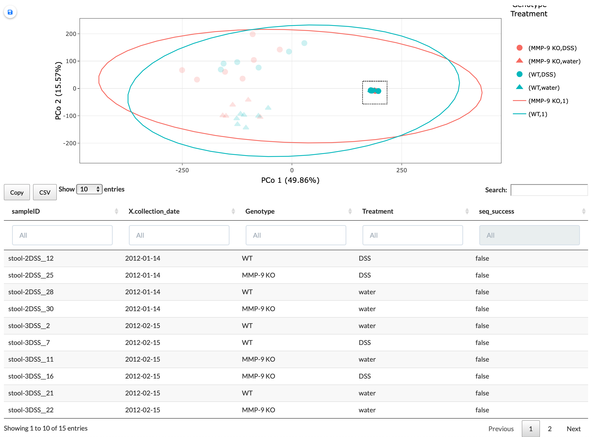{width=100%}
### PCA
Principal component analysis is a non-supervised multivariate analysis that depicts samples (scores) in a projected space that reflects the variance explained along each principal component, as well as the features (loadings) that contribute to relative sample associations.

Since features tend to span several orders of magnitude, three scaling options are provided to handle how features of different magnitudes are weighted:

* **no scaling applied** -- it can be informative to view PCA with unscaled features to see if the samples can be differentiated by the most predominant features.
* **unit variance scaling** -- scales features so they all have the same mean and standard deviation, thus all features are weighted equally. This is the default choice as it is standard practice in microbiome data analysis.
* **pareto scaling** -- adjusted weighting of extreme values (e.g. very high or very low) such that they are more moderate so all features are on the same order of magnitude. This option if only available when no transformation has been applied.
* **vast scaling** -- placing greater weighting on features that are stable, assuming that highly variable measures are unreliably noisy.

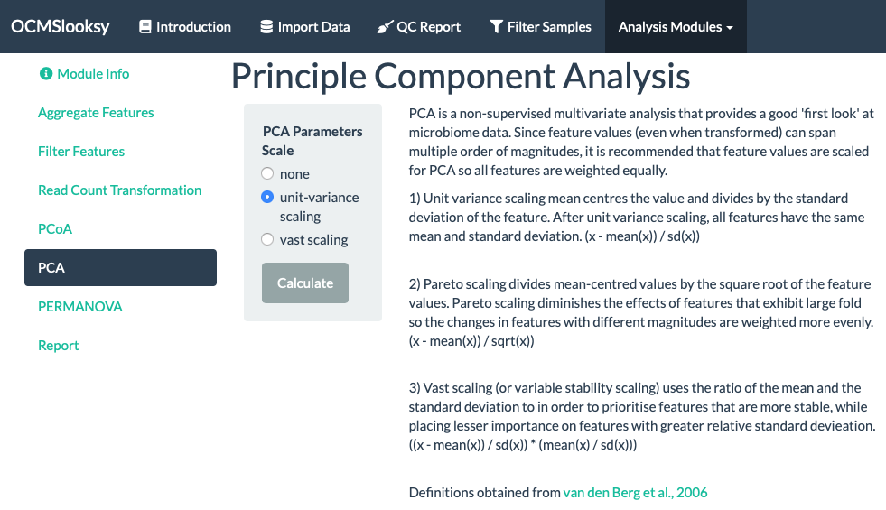{width=100%}
Once the PCA has been "calculated" a summary of the PCA is provided, showing the proportion of variance explained along each principal component and the cumulative variance explained. 

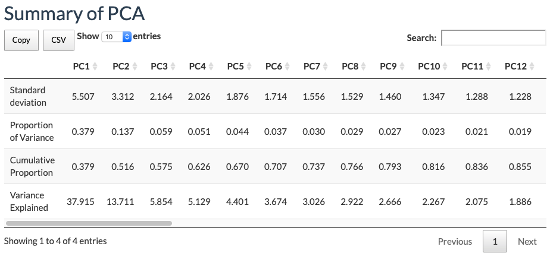{width=100%}
Three plotting options are provided for visualizing PCA:

* Score plot -- only shows samples
* Loading plot -- only shows features
* Biplot -- score and loadings are scaled such that they are overlaid.

Even though the three plots reflect the same underlying PCA, the score and loading plot are provided individually so data points can be highlighted, and corresponding metadata displayed in a table below the score/loading plot. To de-select data points, double-click on the plot area.

Plotting parameters allow you to adjust the colour of data points and their label. Be default, no colour or labelling are assigned, but you can select a variable to colour/label the data points by. The size and transparency of data points/labels can also be customized. Finally, ellipses showing a confidence interval can be applied to scores. Confidence intervals are drawn around the sample groupings defined by sample colours.

#### Score plot
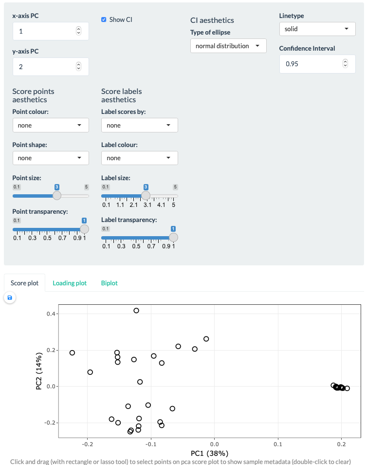{width=100%}

#### Loading plot
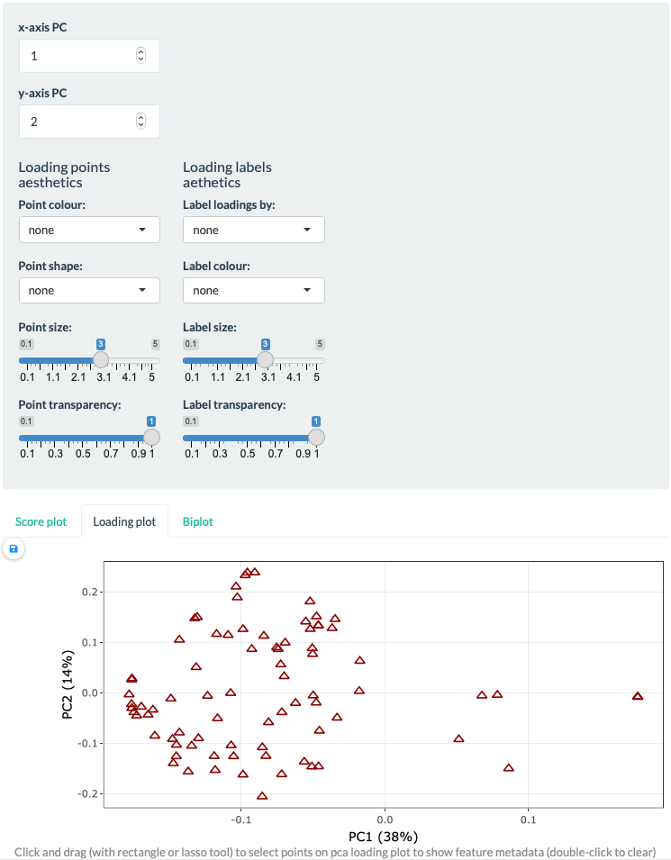{width=100%}

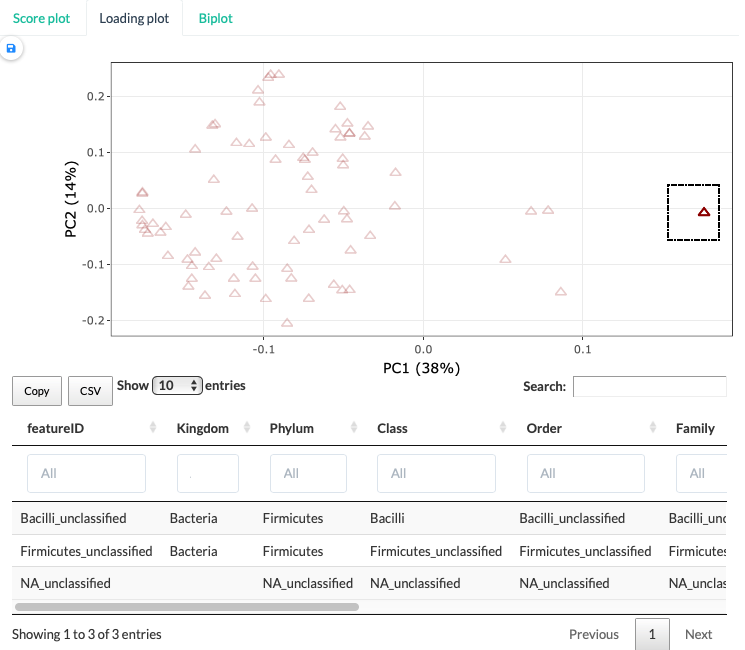{width=100%}

#### Biplot
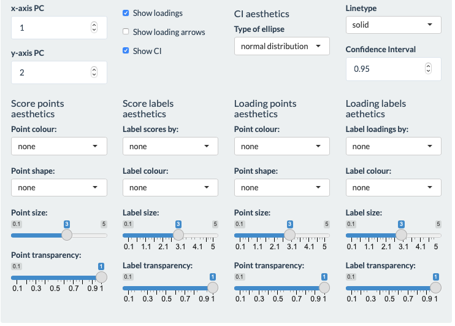{width=100%}

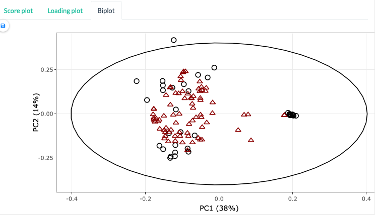{width=100%}

### PERMANOVA
Permuntational multivariate analysis of variance is a statistical test that partitions total variation in response to one or more factors. Variance is attributed based on a dissimilarity measure and is similar to that standard ANOVA in that it uses amoung-group sum-of-squares and within-group sum-of-squares to partition total variance. This analysis uses the function [`vegan::adonis2()`]( "https://cran.r-project.org/web/packages/vegan/vegan.pdf") to perform the PERMANOVA.

This analysis can be applied to complex experimental designs, modeling main effects, hierarchical structures, and experiment design blocks. You can build your model by dragging variables (obtained from the metadata table) into the box on the right side. 

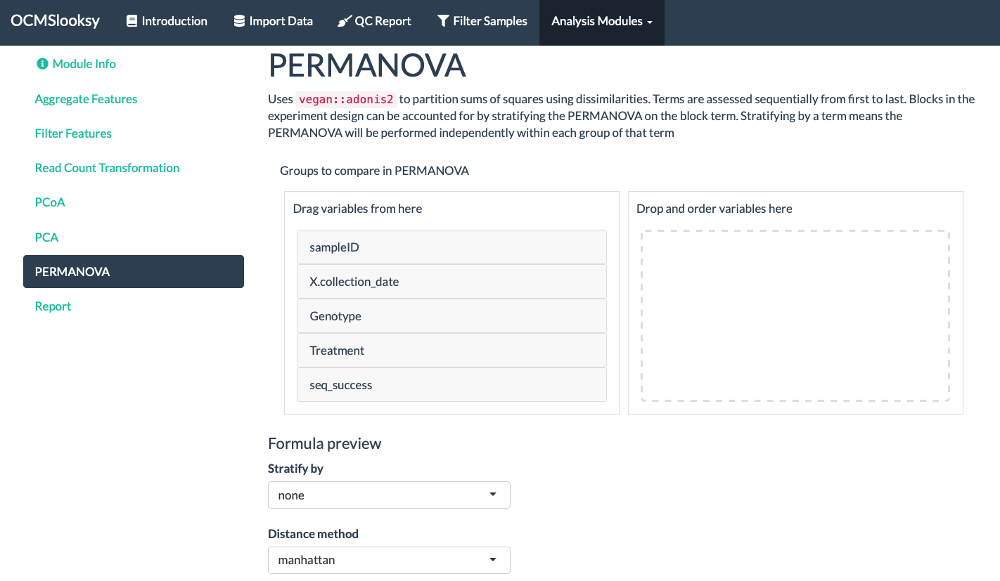{width=100%}

The order of variables in the right-side box dictates the order by which the PERMANOVA will attribute sources of variation. Terms are tested sequentially such that the test will try to explain as much variance as possible to the first term, and the second term will be explained with the remaining unexplained variance. 

In the example below, the Treatment and Genotype variables are included in the PERMANOVA, with samples assessed using Bray-Curtis dissimilarity distance (because data was prepared with percent abundance normalization). We see in the PERMANOVA results that Treatment explains 9% of total variance (R2=0.09) while Genotype explains 1% of the remaining variance (R2=0.01), and there are 90% of unexplained variance in the model (Residual R2=0.896).

Statistical significance of each term is also assessed, showing the F-statistic and corresponding p-value. In our example, neither terms are statistically significant (p < 0.05).

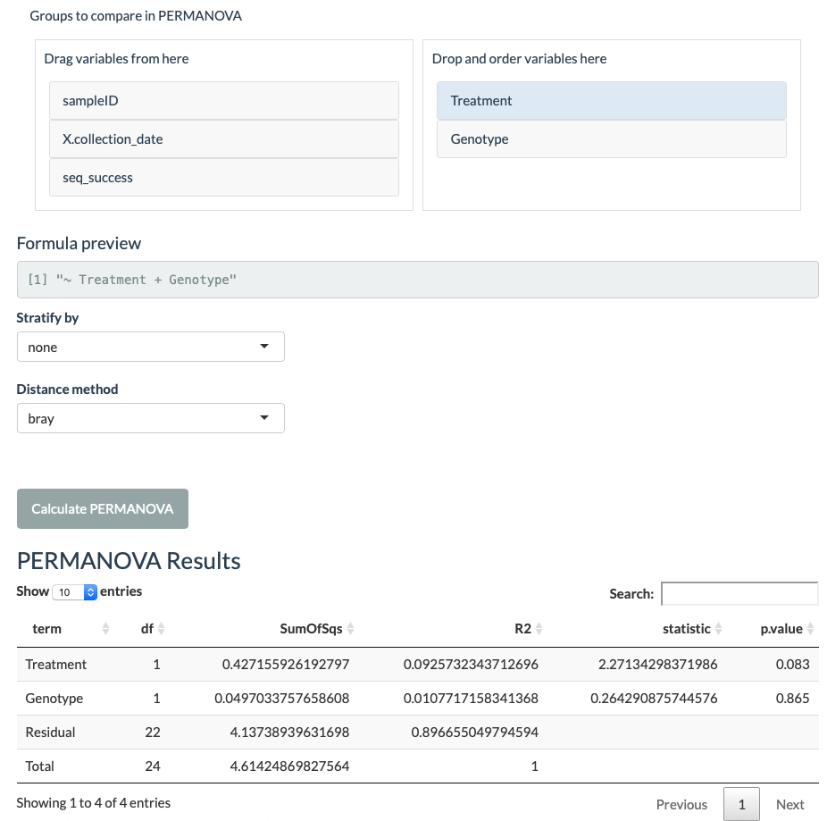{width=100%}

We could also assess the effect of Treatment in each Genotype independently by setting Genotype as the experiment design block using the "Stratify by" parameter. 
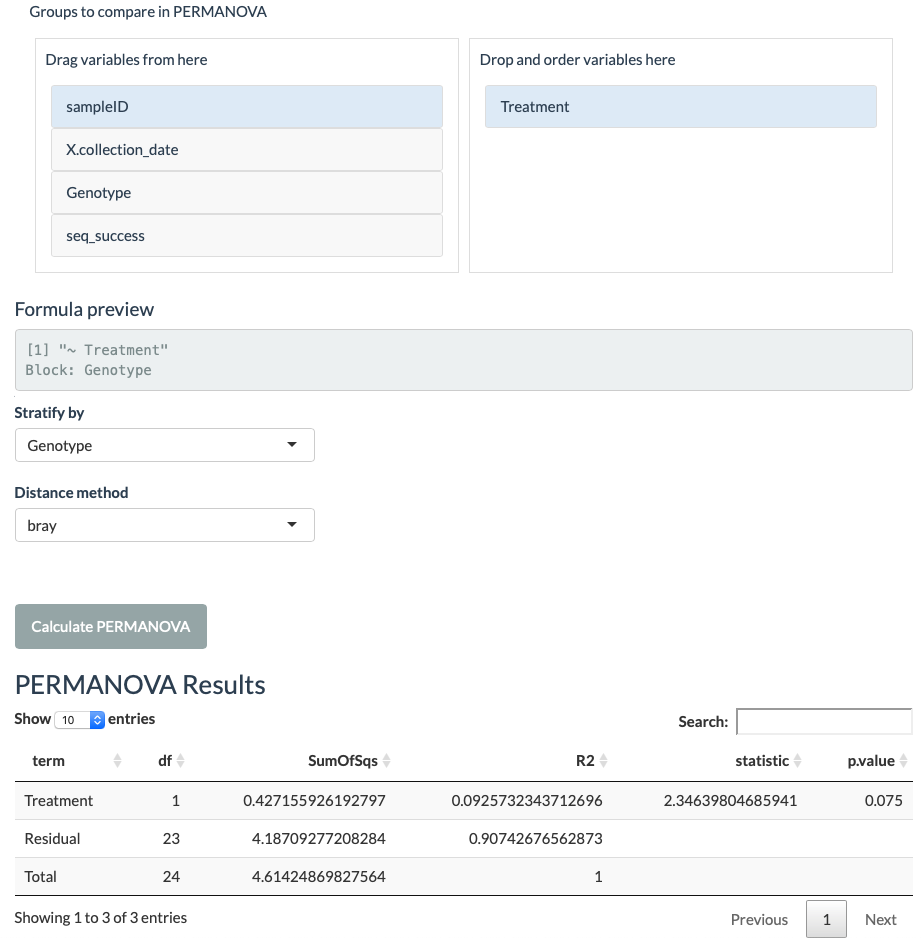{width=100%}

Currently, the app does not allow for experiment designs that include interaction terms or evaluating terms as random effects. 

## Differential Abundance {#DiffAbund}

The Differential Abundance analysis module uses the R package [`DESeq2`](https://bioconductor.org/packages/release/bioc/html/DESeq2.html) to identify features that are differentially abundant between two groups. DESeq2 normalises counts by dividing read count by the geometric mean of that taxon across all samples. Normalised counts are then transformed by `log2` . `DESeq2` assess differential abundance using negative binomial generalized linear models and tests model fit with the Wald test. Details on DESeq2 can be found in the [package vignette](https://www.bioconductor.org/packages/release/bioc/vignettes/DESeq2/inst/doc/DESeq2.html).

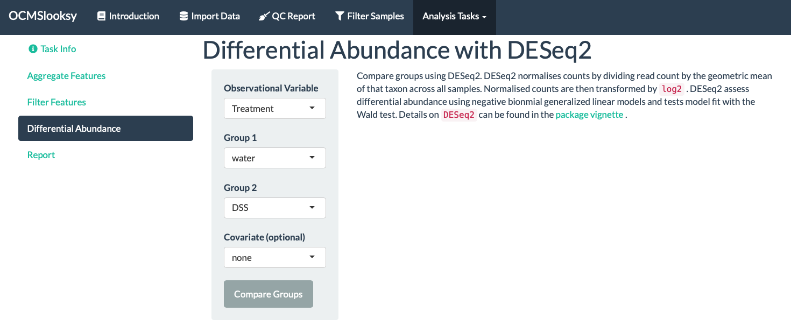{width=100%}

To get started, choose the experiment factor (e.g. observational variable) that you want to compare, then choose the two groups to compare. Groups must have at least two samples. In the example, we chose Treatment as the observational variable so we can compare samples in the DSS treatment group against samples in the water (control) group.

Click "Compare Groups" to start the analysis. This may take a couple minutes, depending on how large your dataset is. Once the calculation is complete, a summary of the analysis is shown, as well as a table listing the fold change (log2FoldChange) between the two groups, the standard error of the fold change (lfcSE), test statistics, p-values, and adjusted p-values (adjusted using Benjimani-Hochberg method).

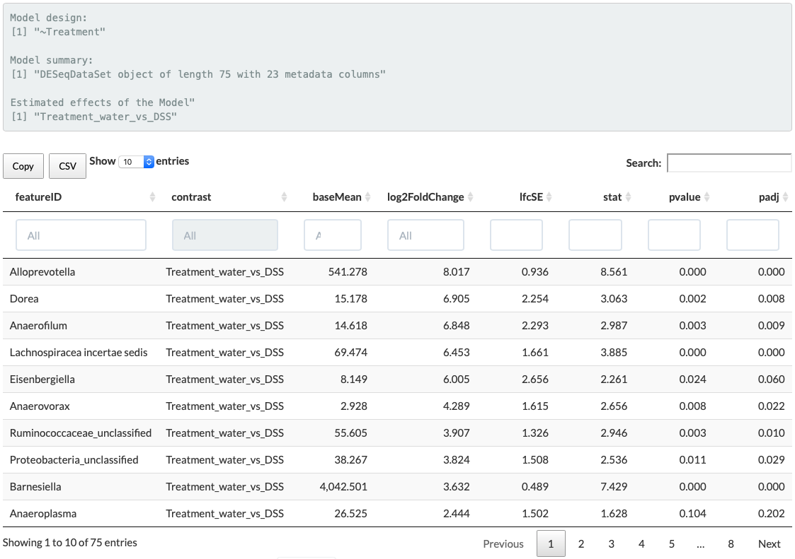{width=100%}

### Differential abundance with covariates and interaction term

There is also an option to include a co-variate and whether or not the interaction between the two variables should be included in the analysis. For example, in addition to assessing Treatment, we can include Genotype as a second term in the model. Including two terms means that two contrasts will be assessed: control treatment (water) vs. DSS treatment, and wildtype genotype vs. MMP.9.KO genotype. Lastly, if we include the interaction between the two variates as a third term, a third contrast will be assessed: change in genotype (WT vs MPP.9.KO) vs change in treatment (water vs DSS). The notation of the interaction contrast is `GenotypeWT.Treatmentwater`

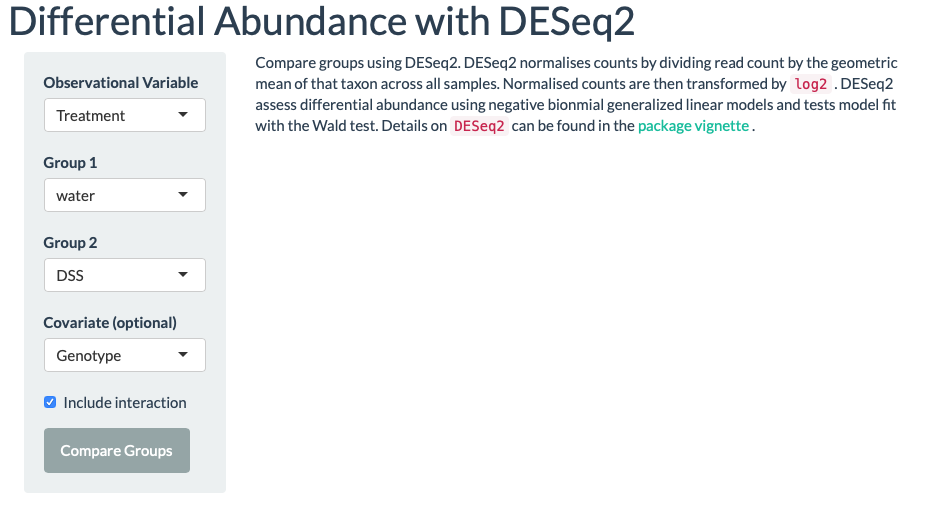{width=100%}

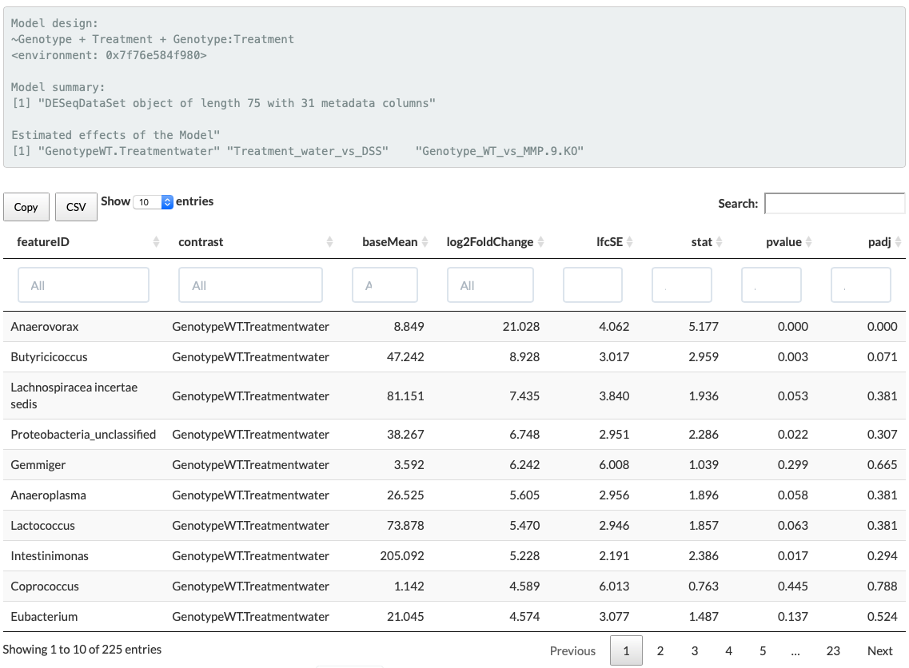{width=100%}

### Visualizing differential abundance

The results from differential abundance analysis are visualized as a volcano plot and as a dot plot of the log2-fold change. Significance and fold-change thresholds are set in the panel on the left. Data points on the volcano plot can be selected to show their abundance in each group. Abundance is shown as regularized log-transformed count. To clear your selection, double-click anywhere in the volcano plot area.

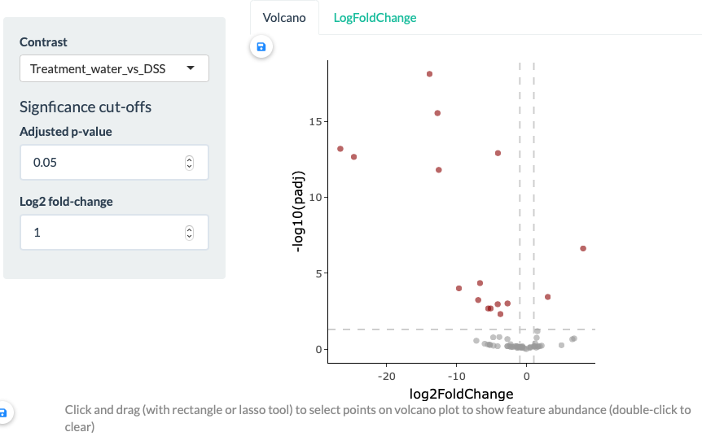{width=100%}

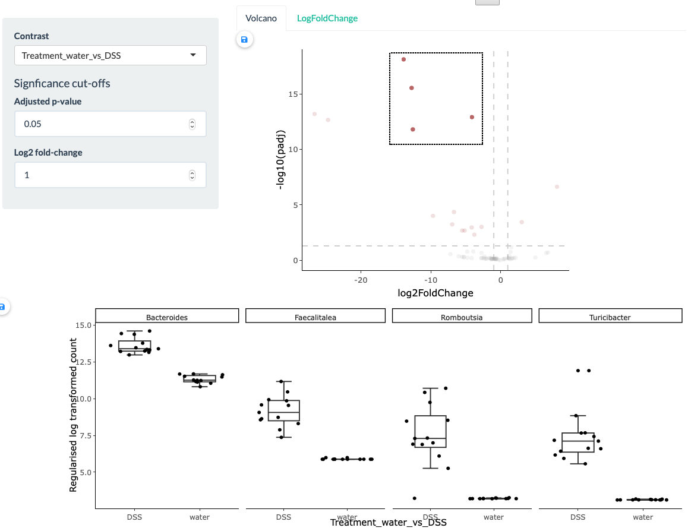{width=100%}

The log2-fold change plot only show taxa that are significant (as set by p-value and fold-change cut-offs).

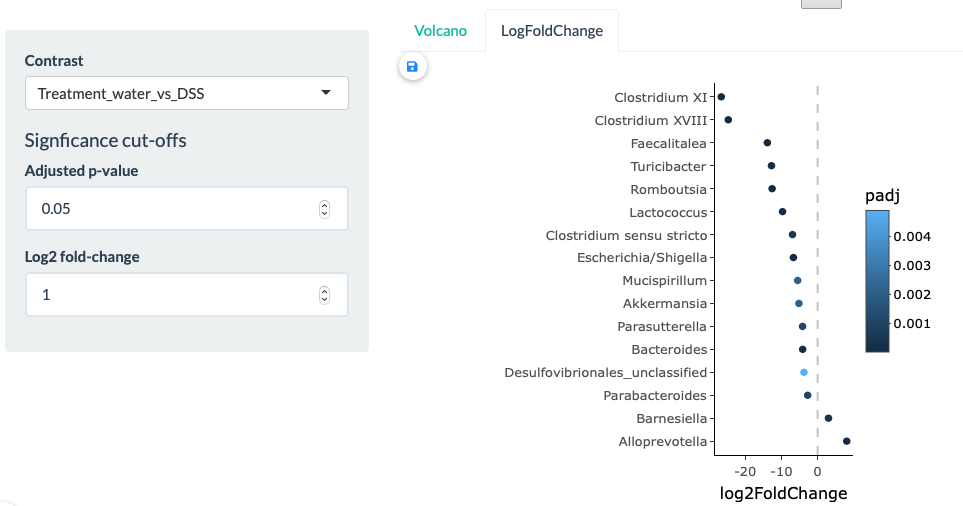{width=100%}

## Pairwise Feature Comparison {#FeatureCompare}
This analysis module performs pair-wise feature analysis, where the correlation of a pair of features are assessed. Rather than using a correlation measure, like Spearman's correlation, the relationship between two features are assessed as a ratio. In other words, features are assessed based on how proportional they are to each other. The metric used is the proportionality index, rho (\u03C1), which ranges from -1 to 1. More extreme rho values indicate a stronger association. 

Proportionality is calculated on CLR-transformed counts. Please note that the CLR-transformation applied does not impute zeroes. Rather, all zero counts are replaced with 1, and then CLR-transformed. This is different than CLR-transformation performed by ALDEx2 applied elsewhere in the app, which imputes zero values from Monte-Carlo sampling of a Dirichlet distribution. Please take caution that spurious correlations may occur with zero counts if your dataset is sparse (high proportion of zeros).

The proportionality analysis may take several minutes, particularly for data sets with a large number of features (>1000). 

Once rho values have been calculated, a false discovery rate (FDR) table is displayed to help you choose an appropriate rho cut-off. This table shows the FDR expected at different rho cut-offs. Typically, you want to limit your FDR to less than 0.05. Empirically, for 16S, rho of 0.6 is a good starting place. We can see in our example below that at rho > |0.65| we can expect a FDR of 0.01.

{width=100%}

In addition to the FDR table, a summary of rho values is shown in the form of a histogram is given to help you limit the number of features pairs to visualize. You can choose to show features inside the range (weak associations) or outside the range (strong associations).

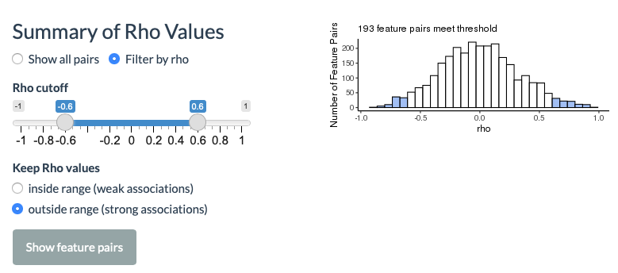{width=100%}

After you click "Show feature pairs" summary of the selected features are shown: a histogram to display of the distribution of feature-pair relationships and the quartile breakdown of the rho distribution.

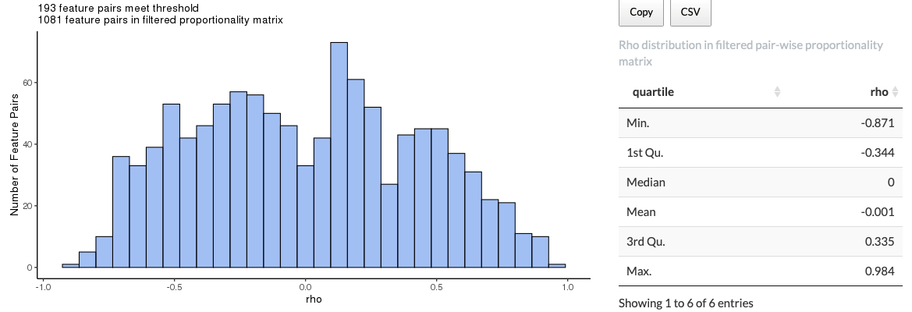{width=100%}

A proportionality matrix displays those feature pairs, with options to adjusted the linkage and distance methods that determine how features are clustered.

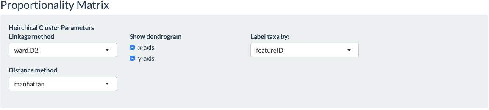{width=100%}
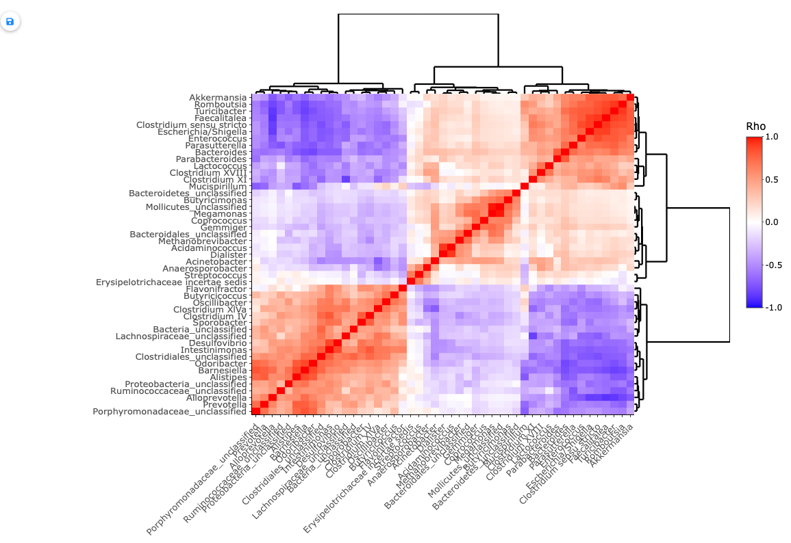{width=100%}

You can also visualize specific feature pairs by selecting them from a searchable table. Selected features are shown as their CLR-transformed counts either as a feature pair, with one feature 1 on the x-axis and feature 2 on the y-axis, or the feature pair is shown according to an experiment variable.

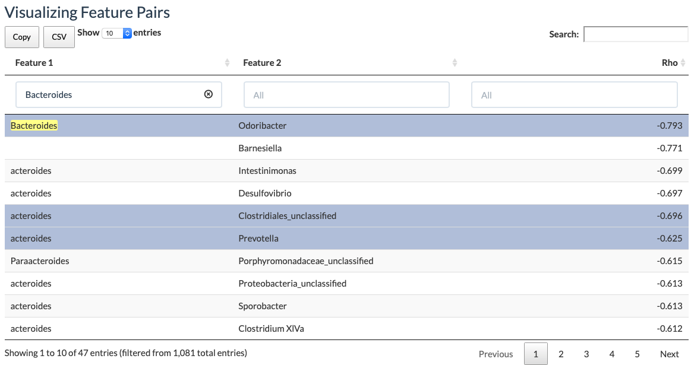{width=100%}

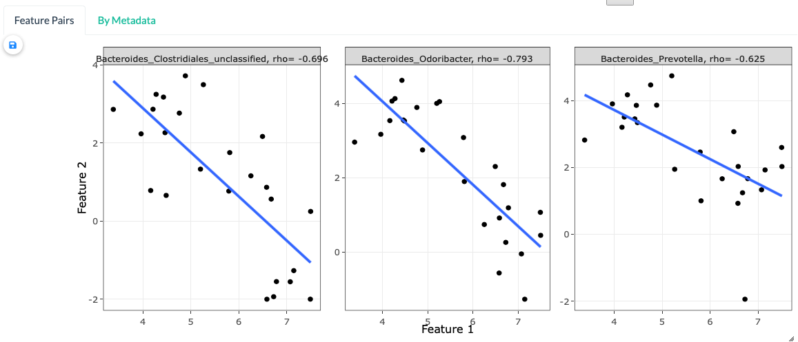{width=100%}

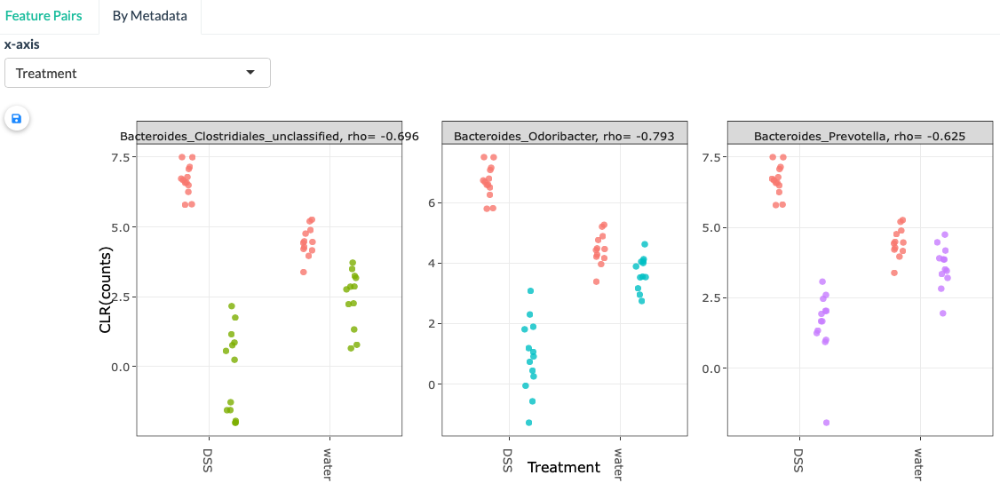{width=100%}